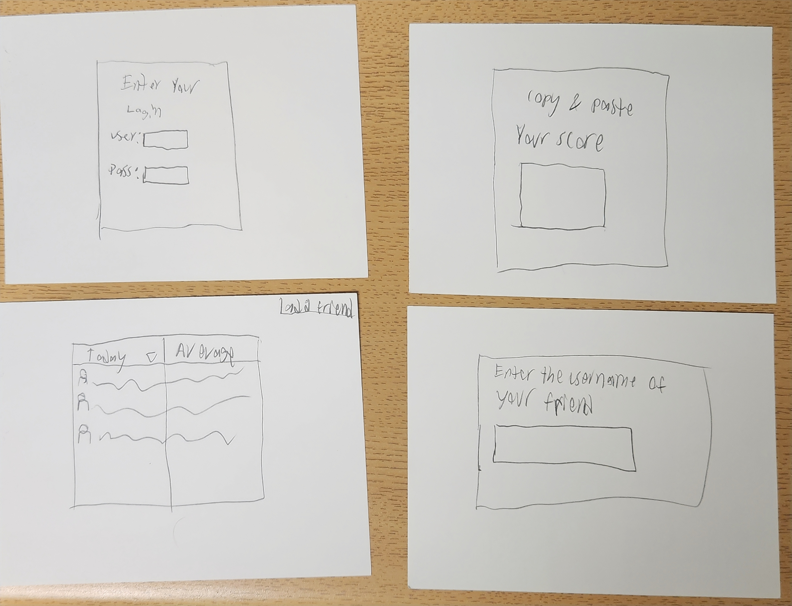
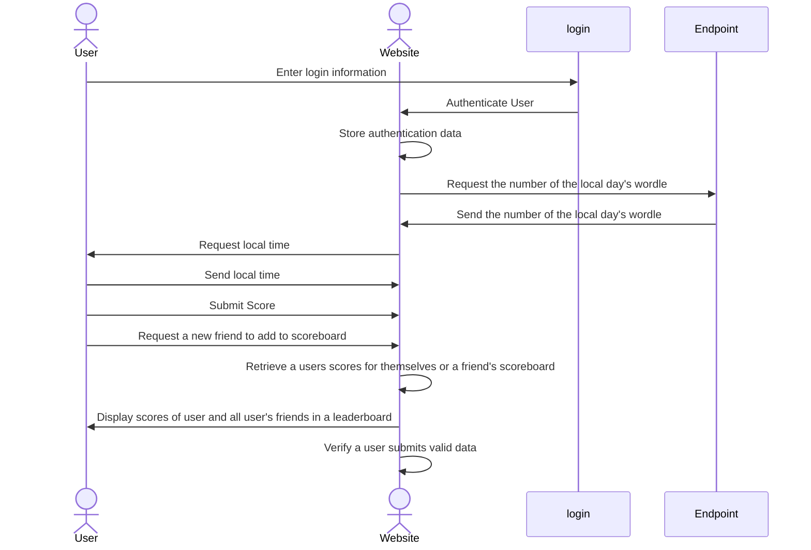

# Wordle With Friends!

[My Notes](notes.md)

This website will allow a user to create a login, and to submit their wordle score once per day (local time) and be able to compare their scores with other people of their choosing. By inputting the username of another person, they will be able to see them on their "friends list" and be able to compare scores with them. The website will automatically check with the worldle website (hopefully) and confirm that the user is submitting the correct day's wordle. The friends list display will show the score of their friends only after the user has submitted their own score, and will show their score for the day, as well as their average score for all scores submitted.

> [!NOTE]
>  This is a template for your startup application. You must modify this `README.md` file for each phase of your development. You only need to fill in the section for each deliverable when that deliverable is submitted in Canvas. Without completing the section for a deliverable, the TA will not know what to look for when grading your submission. Feel free to add additional information to each deliverable description, but make sure you at least have the list of rubric items and a description of what you did for each item.

> [!NOTE]
>  If you are not familiar with Markdown then you should review the [documentation](https://docs.github.com/en/get-started/writing-on-github/getting-started-with-writing-and-formatting-on-github/basic-writing-and-formatting-syntax) before continuing.

## 🚀 Specification Deliverable

> [!NOTE]
>  Fill in this sections as the submission artifact for this deliverable. You can refer to this [example](https://github.com/webprogramming260/startup-example/blob/main/README.md) for inspiration.

For this deliverable I did the following. I checked the box `[x]` and added a description for things I completed.

- [X] Proper use of Markdown
- [X] A concise and compelling elevator pitch
- [X] Description of key features
- [X] Description of how you will use each technology
- [X] One or more rough sketches of your application. Images must be embedded in this file using Markdown image references.

### Elevator pitch

This website will provide a means for individuals to submit their daily Wordle scores and compare them to the scores of their friends. The website will show a daily scoreboard of the wordle for the day, as well as a scoreboard of the average score for the account.

### Design

### Key features

- Will have a login page and will save the login
- Will allow a users to submit a score once per day in local time (if I can't figure out a local time, I'll say when the leaderboard resets)
- Allow users to friend others and the website will display the friends' scores.

### Technologies

I am going to use the required technologies in the following ways.

- **HTML** - Website page with a login page, a submit page, and a scoreboard page. Login and submit will take
- **CSS** - Default dark mode, pretty buttons, etc.
- **React** - Button to add a friend to their leaderboard list
- **Service** - login authentication, save scores and calculate average, check w/ the wordle website to determine when to allow users to submit the next day's score.
- **DB/Login** - account and login, username will be accessed by others to add to friends list.
- **WebSocket** - updates the page when a friend submits a score.

## 🚀 AWS deliverable

For this deliverable I did the following. I checked the box `[x]` and added a description for things I completed.

- [X] **Server deployed and accessible with custom domain name** - [My server link](https://yourdomainnamehere.click).

## 🚀 HTML deliverable

For this deliverable I did the following. I checked the box `[x]` and added a description for things I completed.

- [X] **HTML pages** - Created pages for each feature of my website.
- [X] **Proper HTML element usage** - I studied HTML elements and implemented tags such as: anchor, paragraph, div, form, h1, header, footer, main, menu, span, button, etc.
- [X] **Links** - Had Navigable directory for the website and also linked to the wordle website.
- [ ] **Text** - About page has text
- [ ] **3rd party API placeholder** - I did not complete this part of the deliverable.
- [ ] **Images** - I did not complete this part of the deliverable.
- [X] **Login placeholder** - Contained in main HTML
- [X] **DB data placeholder** - scores placeholder displayed on disp_scores.html
- [X] **WebSocket placeholder** - placeholder for notifications for when friends submit scores on disp_scores.html

## 🚀 CSS deliverable

For this deliverable I did the following. I checked the box `[x]` and added a description for things I completed.

- [ ] **Header, footer, and main content body** - I did not complete this part of the deliverable.
- [ ] **Navigation elements** - I did not complete this part of the deliverable.
- [ ] **Responsive to window resizing** - I did not complete this part of the deliverable.
- [ ] **Application elements** - I did not complete this part of the deliverable.
- [ ] **Application text content** - I did not complete this part of the deliverable.
- [ ] **Application images** - I did not complete this part of the deliverable.

## 🚀 React part 1: Routing deliverable

For this deliverable I did the following. I checked the box `[x]` and added a description for things I completed.

- [ ] **Bundled using Vite** - I did not complete this part of the deliverable.
- [ ] **Components** - I did not complete this part of the deliverable.
- [ ] **Router** - Routing between login and voting components.

## 🚀 React part 2: Reactivity

For this deliverable I did the following. I checked the box `[x]` and added a description for things I completed.

- [ ] **All functionality implemented or mocked out** - I did not complete this part of the deliverable.
- [ ] **Hooks** - I did not complete this part of the deliverable.

## 🚀 Service deliverable

For this deliverable I did the following. I checked the box `[x]` and added a description for things I completed.

- [ ] **Node.js/Express HTTP service** - I did not complete this part of the deliverable.
- [ ] **Static middleware for frontend** - I did not complete this part of the deliverable.
- [ ] **Calls to third party endpoints** - I did not complete this part of the deliverable.
- [ ] **Backend service endpoints** - I did not complete this part of the deliverable.
- [ ] **Frontend calls service endpoints** - I did not complete this part of the deliverable.

## 🚀 DB/Login deliverable

For this deliverable I did the following. I checked the box `[x]` and added a description for things I completed.

- [ ] **User registration** - I did not complete this part of the deliverable.
- [ ] **User login and logout** - I did not complete this part of the deliverable.
- [ ] **Stores data in MongoDB** - I did not complete this part of the deliverable.
- [ ] **Stores credentials in MongoDB** - I did not complete this part of the deliverable.
- [ ] **Restricts functionality based on authentication** - I did not complete this part of the deliverable.

## 🚀 WebSocket deliverable

For this deliverable I did the following. I checked the box `[x]` and added a description for things I completed.

- [ ] **Backend listens for WebSocket connection** - I did not complete this part of the deliverable.
- [ ] **Frontend makes WebSocket connection** - I did not complete this part of the deliverable.
- [ ] **Data sent over WebSocket connection** - I did not complete this part of the deliverable.
- [ ] **WebSocket data displayed** - I did not complete this part of the deliverable.
- [ ] **Application is fully functional** - I did not complete this part of the deliverable.
